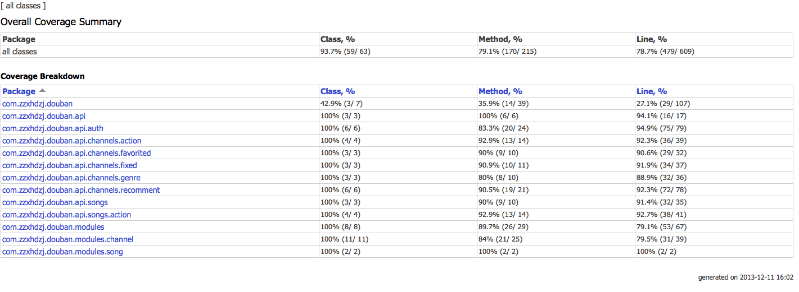
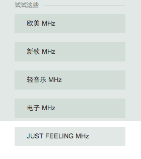
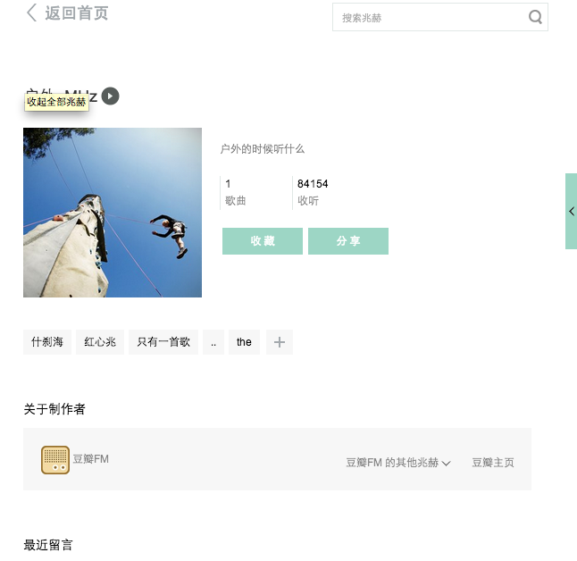

Douban FM API
---
#Logs

- 2013-12-11 1.0-SNAPSHOT
- 2014-03-29 1.0-RC

    增加surefire-report支持

        mvn site
        mvn surefire-report:report

    错误级别细分

        CommonTextApiResponseCallback
- 2014-05-28
    
    因302 set-cookie问题使用apache-http未能解决（之前采用了禁止redirect方式），所以client换做UrlConnection，但保留apache-http的数据结构，比较方便。
    
    通过vm-wide+SharedPreference持久化cookie[Sessions with Cookies](http://developer.android.com/reference/java/net/HttpURLConnection.html)
    
    重构部分代码
    
    unitest mock http request 换用 okhttp的mockwebserver

- 2014-05-29
    
    重构HiHttp:custom PrefsCookieStore:uri去掉path（暂时可以满足path为`/`的情况，以后再逐步增加cookie支持）。
    
- 2014-05-30
    
    匿名接口和禁止匿名接口的错误封装
    
    Cookie remove的线程安全
    
    
- 2014-06-02
    
    增加channel provider，用于存放和查询频道信息
    
    todo：抽象代码
    
#Usage:
0 [demo](https://github.com/ampm/DoubanFM-android.git)会不断完善，直至一个完整的客户端
1 install

    mvn install

2 import

pre dependency:

    <dependency>
        <groupId>com.zzxhdzj.http</groupId>
        <artifactId>HiHttp</artifactId>
        <version>1.0-SNAPSHOT</version>
    </dependency>

3 SDK dependency:

    <dependency>
        <groupId>com.zzxhdzj.douban</groupId>
        <artifactId>DoubanFM-sdk</artifactId>
        <version>1.0-SNAPSHOT</version>
    </dependency>

4 Thanks to Third party lib:

    ASimpleCache: https://github.com/yangfuhai/ASimpleCache

5 Test

        mvn site
        mvn surefire-report:report
6 coverage by Intellij

6 TODO:

    1 换频率报告
    2 切换频率
    3 是否已收藏频率

#公共API

无需登录授权,url get 参数需要urlencode
##获取验证码id

API:

    http://douban.fm/j/new_captcha

Request:

    Method:GET
    Content-Type:application/x-www-form-urlencoded

Response:

    Server:nginx
    Content-Type:application/json; charset=utf-8
    Set-Cookie:bid="3O4V/vRO+uE"; domain=.douban.fm; path=/; expires=Mon, 24-Nov-2014 14:25:20 GMT,ac="1385303119"; path=/; domain=.douban.fm
    Body:
    "8Z9w6tODHEukHkAmBz52dWg4:en"

##获取验证码图片

API:

    http://douban.fm/misc/captcha

Request:
    
    Method:GET
    Content-Type:application/x-www-form-urlencoded
    Cookie：ac="1385303119"; bid="3O4V/vRO+uE"; ck="deleted"; dbcl2="deleted"; flag="ok"; start=

GET Params:

    size:m
    id:获取到的验证码id

Response：

    Content-Type:image/jpeg
##登录

API

    http://douban.fm/j/login

Request:
    
    Method:POST
    Content-Type:application/x-www-form-urlencoded

POST Params:

    remember:on/off
    source:radio
    captcha_solution:cheese
    alias:xxxx%40gmail.com
    form_password:password
    captcha_id:jOtEZsPFiDVRR9ldW3ELsy57%3en

Response：

    Content-Type:application/json; charset=utf-8
    set-Cookie:bid="U6ALTWjZexM";ck="bPhq"; dbcl2="69077079:hXADDW6guJg";

    OK_Body:
    {
        "r": 0,
        "user_info": {
            "ck": "10se",
            "id": "69077079",
            "is_dj": false,
            "is_new_user": 0,
            "is_pro": false,
            "name": "hijack",
            "play_record": {
                "banned": 44,
                "fav_chls_count": 2,
                "liked": 58,
                "played": 1715
            },
            "third_party_info": null,
            "uid": "69077079",
            "url": "http://www.douban.com/people/69077079/"
        }
    }

    Failed_Body:s
    {"err_no":1011,"r":1,"err_msg":"验证码不正确|xxx|xxx"}
    
#获取频道列表

###热门兆赫：
API

    /j/explore/hot_channels

GET:

    start=1&limit=6

    Body:
    {
        "data": {
            "channels": [
                {
                    "banner": "http://img3.douban.com/img/fmadmin/chlBanner/27675.jpg",
                    "cover": "http://img3.douban.com/img/fmadmin/icon/27675.jpg",
                    "creator": {
                        "id": 48254923,
                        "name": "Bin's",
                        "url": "http://www.douban.com/people/48254923/"
                    },
                    "hot_songs": [
                        "\u539f\u8c05",
                        "Better Me (\u56fd\u8bed)",
                        "\u9b54\u9b3c\u4e2d\u7684\u5929\u4f7f"
                    ],
                    "id": 1000382,
                    "intro": "\u7ec6\u542c\u7740\u522b\u4eba\u7684\u6b4c\u58f0\uff0c\u8bc9\u8bf4\u7740\u81ea\u5df1\u7684\u6545\u4e8b\u3002",
                    "name": "\u4f60\u7684\u6b4c\u8bcd\u6211\u7684\u6545\u4e8b",
                    "song_num": 384
                }
            ],
            "total": 23743
        },
        "status": true
    }
###上升最快    

API
    
    /j/explore/up_trending_channels

GET:

    start=1&limit=6

    Body:
    {
        "data": {
            "channels": [
                {
                    "banner": "http://img3.douban.com/img/fmadmin/chlBanner/27675.jpg",
                    "cover": "http://img3.douban.com/img/fmadmin/icon/27675.jpg",
                    "creator": {
                        "id": 48254923,
                        "name": "Bin's",
                        "url": "http://www.douban.com/people/48254923/"
                    },
                    "hot_songs": [
                        "\u539f\u8c05",
                        "Better Me (\u56fd\u8bed)",
                        "\u9b54\u9b3c\u4e2d\u7684\u5929\u4f7f"
                    ],
                    "id": 1000382,
                    "intro": "\u7ec6\u542c\u7740\u522b\u4eba\u7684\u6b4c\u58f0\uff0c\u8bc9\u8bf4\u7740\u81ea\u5df1\u7684\u6545\u4e8b\u3002",
                    "name": "\u4f60\u7684\u6b4c\u8bcd\u6211\u7684\u6545\u4e8b",
                    "song_num": 384
                }
            ],
            "total": 23743
        },
        "status": true
    }

###品牌兆赫    
API：
    http://douban.fm/#

Resp：Html解析

    window.com_channels_json = [
    {
        "banner": "http://img3.douban.com/img/fmadmin/chlBanner/27470.jpg",
        "cover": "http://img3.douban.com/img/fmadmin/icon/27470.jpg",
        "creator": {
            "id": 1,
            "name": "\u8c46\u74e3FM",
            "url": "http://site.douban.com/douban.fm/"
        },
        "hot_songs": [
            "\u7687\u540e\u5927\u9053\u4e1c",
            "Casablanca",
            "Tokyo"
        ],
        "id": 159,
        "intro": "\u6bcf\u9996\u6b4c\u66f2\u90fd\u662f\u4e00\u4e2a\u9065\u8fdc\u7684\u5730\u5740\uff0c\u5c31\u8ba9\u5fc3\u7075\u638c\u8235\uff0c\u671d\u7740\u95ea\u5ff5\u7684\u65b9\u5411\uff0c\u97f3\u7b26\u4f1a\u5e26\u4f60\u5411\u524d\uff0c\u58f0\u97f3\u4f1a\u4e3a\u4f60\u6307\u8def\u3002",
        "name": "\u6717\u5883\u00b7\u95ea\u5ff5\u7684\u58f0\u97f3",
        "song_num": 100
    }
    ];

###已知固定频道
channel=0 私人兆赫  type=s

####Region&Lang

    channel=1 公共兆赫【地区 语言】：华语MHZ
    channel=6 公共兆赫【地区 语言】：粤语MHZ
    channel=2 公共兆赫【地区 语言】：欧美MHZ
    channel=22 公共兆赫【地区 语言】：法语MHZ
    channel=17 公共兆赫【地区 语言】：日语MHZ
    channel=18 公共兆赫【地区 语言】：韩语MHZ

####Ages

    channel=3  公共兆赫【年代】：70年代MHZ
    channel=4  公共兆赫【年代】：80年代MHZ
    channel=5  公共兆赫【年代】： 90年代MHZ

###Genre
    channel=8 公共兆赫【流派】：民谣MHZ
    channel=7 公共兆赫【流派】：摇滚MHZ
    channel=13 公共兆赫【流派】：爵士MHZ
    channel=27 公共兆赫【流派】：古典MHZ
    channel=14 公共兆赫【流派】：电子MHZ
    channel=16 公共兆赫【流派】：R&BMHZ
    channel=15 公共兆赫【流派】：说唱MHZ
    channel=10 公共兆赫【流派】：电影原声MHZ

####Special

    channel=20 公共兆赫【特辑】：女声MHZ
    channel=28 公共兆赫【特辑】：动漫MHZ
    channel=32 公共兆赫【特辑】：咖啡MHZ
    channel=67 公共兆赫【特辑】：东京事变MHZ

####Com

    channel=52 公共兆赫【品牌】：乐混翻唱MHZ
    channel=58 公共兆赫【品牌】：路虎揽胜运动MHZ

####Artist

    channel=26 公共兆赫：豆瓣音乐人MHZ
    channel=dj DJ兆赫

###根据流派获取频道

API：

    http://douban.fm/j/explore/genre?gid=326&start=0&limit=20

已知流派：

    <ul class="fm-side-taglist clearfix">
            <li data-genre_id="335">摇滚</li>
            <li data-genre_id="326">古典</li>
            <li data-genre_id="327">爵士</li>
            <li data-genre_id="337">民谣/乡村</li>
            <li data-genre_id="331">流行</li>
            <li data-genre_id="325">电子</li>
            <li data-genre_id="328">原声配乐</li>
            <li data-genre_id="332">轻音乐</li>
            <li data-genre_id="334">说唱</li>
            <li data-genre_id="330">雷鬼</li>
            <li data-genre_id="329">拉丁</li>
            <li data-genre_id="333">世界音乐</li>
            <li data-genre_id="324">布鲁斯</li>
            <li data-genre_id="336">放克/灵歌/R&amp;B</li>
    </ul>        

Resp：

    {
        "data": {
            "channels": [
                {
                    "banner": "http://img3.douban.com/img/fmadmin/chlBanner/27675.jpg",
                    "cover": "http://img3.douban.com/img/fmadmin/icon/27675.jpg",
                    "creator": {
                        "id": 48254923,
                        "name": "Bin's",
                        "url": "http://www.douban.com/people/48254923/"
                    },
                    "hot_songs": [
                        "\u539f\u8c05",
                        "Better Me (\u56fd\u8bed)",
                        "\u9b54\u9b3c\u4e2d\u7684\u5929\u4f7f"
                    ],
                    "id": 1000382,
                    "intro": "\u7ec6\u542c\u7740\u522b\u4eba\u7684\u6b4c\u58f0\uff0c\u8bc9\u8bf4\u7740\u81ea\u5df1\u7684\u6545\u4e8b\u3002",
                    "name": "\u4f60\u7684\u6b4c\u8bcd\u6211\u7684\u6545\u4e8b",
                    "song_num": 384
                }
            ],
            "total": 23743
        },
        "status": true
    }

###查询频道信息
    API:

    http://douban.fm/j/explore/channel_detail?channel_id=159

###搜索频道

API

    /j/explore/search

Get Params

query=urlencodedParams

Resp

    {
        "data": {
            "channels": [
                {
                    "banner": "http://img3.douban.com/img/fmadmin/chlBanner/26382.jpg",
                    "cover": "http://img3.douban.com/img/fmadmin/icon/26382.jpg",
                    "creator": {
                        "id": 1,
                        "name": "\u8c46\u74e3FM",
                        "url": "http://site.douban.com/douban.fm/"
                    },
                    "hot_songs": [
                        "Prelude",
                        "Antonin Dvorak, Humoresque",
                        "Canon and Gigue in D: Canon"
                    ],
                    "id": 27,
                    "intro": "\u53e4\u5178\u4e50\u4e5f\u80fd\u542c\u5f97\u8f7b\u677e\u968f\u6027",
                    "name": "\u53e4\u5178",
                    "song_num": 4189
                }
            ],
            "total": 5
        },
        "status": true
    }

##根据频道获取歌曲列表
API

    http://douban.fm/j/mine/playlist

Request:

    Method:GET
    Request headers 
    User-Agent: Mozilla/5.0 (Macintosh; Intel Mac OS X 10_9_0) AppleWebKit/537.36 (KHTML, like Gecko) Chrome/31.0.1650.57 Safari/537.36
    Content-Type: text/plain; charset=utf-8 
    Accept: */*
    Accept-Encoding: gzip,deflate,sdch
    Accept-Language: en-US,en;q=0.8

Get Params:

    from=mainsite&channel=1&kbps=128&type=n

Response:

    Server: nginx 
    Content-Type: application/json; charset=utf-8 
    Body:    
    {"r":0,"warning":"user_is_ananymous",
    "song":[
        {"album":"\/subject\/1427374\/","picture":"http:\/\/img3.douban.com\/mpic\/s1441645.jpg","ssid":"6eae","artist":"陈绮贞","url":"http:\/\/mr3.douban.com\/201311260130\/5b668f132f85c33265963e21db190b76\/view\/song\/small\/p191887.mp3","company":"Avex","title":"旅行的意义","rating_avg":4.47197,"length":258,"subtype":"","public_time":"2005","sid":"191887","aid":"1427374","sha256":"1fde4cd188ed5e26e7d2165d74061a74feadf0264160f666ff937b56de89e35d","kbps":"64","albumtitle":"华丽的冒险","like":0},
        {"album":"\/subject\/2142526\/","picture":"http:\/\/img3.douban.com\/mpic\/s4698431.jpg","ssid":"19ab","artist":"卢巧音 \/ 王力宏","url":"http:\/\/mr4.douban.com\/201311260130\/388359d544874dae23510dcbd8b0676e\/view\/song\/small\/p479453.mp3","company":"EMI","title":"好心分手 – DUET WITH 王力宏","rating_avg":4.30213,"length":181,"subtype":"","public_time":"2007","sid":"479453","aid":"2142526","sha256":"967129b2724ca3bdfcc4a16c22f362ef7c01a1b69351e4481ebced0b08b7a32d","kbps":"64","albumtitle":"不能不愛... 盧巧...","like":0}
        ]
    }

#登录后API

需要登录
登录后，切换频道 base api变成
##推荐频道
###登录成功更新推荐频道

uk=user id

http://douban.fm/j/explore/get_login_chls?uk=69077079

http://douban.fm/j/explore/get_login_chls?uk=69077079

    {
        "data": {
            "res": {
                "fav_chls": [
                    {
                        "banner": "http://img3.douban.com/img/fmadmin/chlBanner/26383.jpg",
                        "cover": "http://img3.douban.com/img/fmadmin/small/26383.jpg",
                        "creator": {
                            "id": 1,
                            "name": "\u8c46\u74e3FM",
                            "url": "http://site.douban.com/douban.fm/"
                        },
                        "hot_songs": [
                            "\u600e\u6837",
                            "\u6211\u7684\u6b4c\u58f0\u91cc",
                            "\u5ffd\u7136\u4e4b\u95f4"
                        ],
                        "id": 1,
                        "intro": "\u6bcf\u5929\u53d1\u73b0\u4e00\u9996\u597d\u542c\u7684\u6b4c",
                        "name": "\u534e\u8bed",
                        "song_num": 8023
                    }
                ]
            }
        },
        "status": true
    }

###推荐频道(试试这些)

orecs 猜测，自己加过红心的歌曲所属频道

切换频道的也会发起请求，这个结果会出现在；

recomment.png

http://douban.fm/j/explore/get_recommend_chl?orecs=2|61|9|14

    {
        "data": {
            "res": {
                "cover": "http://img3.douban.com/img/fmadmin/raw/23073",
                "id": 1004097,
                "intro": "Music has always fascinated us in the way that it communicates. Without words,without pictures. ",
                "name": "JUST FEELING"
            }
        },
        "status": true
    }

##收藏频道-

    http://douban.fm/j/explore/fav_channel?cid=1

    {"status":true,"data":{"res":1}}

##取消收藏频道-

    http://douban.fm/j/explore/unfav_channel?cid=61005

    {"status":true,"data":{"res":1}}

##我收藏的频道-
    http://douban.fm/j/fav_channels

        {
            "channels": [
                {
                    "banner": "http://img3.douban.com/img/fmadmin/chlBanner/27132.jpg",
                    "cover": "http://img3.douban.com/img/fmadmin/icon/27132.jpg",
                    "creator": {
                        "id": 1,
                        "name": "\u8c46\u74e3FM",
                        "url": "http://site.douban.com/douban.fm/"
                    },
                    "hot_songs": [
                        "Free Loop",
                        "I'm Yours",
                        "You're Beautiful"
                    ],
                    "id": 153,
                    "intro": "\u5de5\u4f5c\u5b66\u4e60\u7684\u65f6\u5019\u542c\u4ec0\u4e48",
                    "name": "\u5de5\u4f5c\u5b66\u4e60",
                    "song_num": 1
                }
            ]
        }

##换频率报告-

    fcid=fromcid tcid=tocid

    http://douban.fm/j/change_channel?fcid=1&tcid=-3&area=system_chls

        {"r":"0"}

##切换频率-
    http://douban.fm/j/mine/playlist?type=n&sid=660489&pt=28.4&channel=1004097&pb=64&from=mainsite&r=c7ed82182f
            
    type=n 
    0. Log change channel action
    1. change channel.

-Resp

    {
        "r": 0,
        "song": [
            {
                "aid": "6428551",
                "album": "/subject/6428551/",
                "albumtitle": "\u68a6\u5883",
                "artist": "\u8303\u4e16\u742a",
                "company": "\u548c\u6c14\u97f3\u4e50",
                "kbps": "64",
                "length": 284,
                "like": 0,
                "picture": "http://img3.douban.com/view/site/large/public/945a6d8529abfe4.jpg",
                "public_time": "2011",
                "rating_avg": 3.85863,
                "sha256": "8e24e9b10d11e0de7f3990c2b46c00d5a73e3e71c198b090357ddd7ed3d79382",
                "sid": "1646524",
                "ssid": "894f",
                "subtype": "S",
                "title": "\u68a6\u5883",
                "url": "http://mr4.douban.com/201312090030/e39cab2d0aecd0849e31fdf02626da25/view/song/small/p1646524.mp3"
            },
        "warning": "user_is_ananymous"
    }

##是否已收藏频率-

API

	http://douban.fm/j/explore/is_fav_channel?uk=69077079&cid=1003464
	
Resp

    {"status":true,"data":{"res":{"is_fav":false}}}

##我的私人调频-
无需登录，但是返回的歌曲肯定不是你自己的啦
  
	http://douban.fm/j/mine/playlist?type=n&sid=1394146&pt=99.7&channel=0&context=tags:&pb=64&from=mainsite&r=98d6af28bb
  
参数说明

	channel=0
	0. Log change channel action
	1. get songs from my private channel

	type=n(null 意思无操作，其他的如b=ban 不在播放) 

  
    
Resp

	{
        "r": 0,
        "song": [
            {
                "aid": "24834080",
                "album": "/subject/24834080/",
                "albumtitle": "\u6211\u662f\u6d77\u96c5\u8c37\u6155",
                "artist": "\u5f20\u9707\u5cb3",
                "company": "\u6eda\u77f3",
                "kbps": "64",
                "length": 234,
                "like": 0,
                "picture": "http://img3.douban.com/mpic/s26816830.jpg",
                "public_time": "2013",
                "rating_avg": 4.08942,
                "sha256": "002fee6130465ead67593bd63ec35ad0a4a702120b494c11b0352093a05a5a7a",
                "sid": "1939690",
                "ssid": "7506",
                "subtype": "",
                "title": "\u7834\u5409\u4ed6",
                "url": "http://mr3.douban.com/201312091952/2ae3cce5d026fadb156899c0ab541e4f/view/song/small/p1939690.mp3"
            },
            {
                "aid": "1795848",
                "album": "/subject/1795848/",
                "albumtitle": "Dusk And Summer",
                "artist": "Dashboard Confessional",
                "company": "Vagrant Records",
                "kbps": "64",
                "length": 248,
                "like": 0,
                "picture": "http://img3.douban.com/mpic/s4712844.jpg",
                "public_time": "2006",
                "rating_avg": 3.787,
                "sha256": "2dc4c55e49b8c2296102f5771c8d494de4d8c85e284f9cabeddbb5fceac1df7e",
                "sid": "747687",
                "ssid": "9d79",
                "subtype": "",
                "title": "Slow Decay",
                "url": "http://mr3.douban.com/201312091952/07403a07b1095f1f8ca1c1f6f22b6564/view/song/small/p747687.mp3"
            }
        ],
        "warning": "user_is_ananymous"
    }

##红心调频歌曲-

	http://douban.fm/j/mine/playlist?from=mainsite&channel=-3&kbps=64&h=&sid=&type=n&r=927c04500d89d

主要参数：channel=-3

    {
        "r": 0,
        "song": [
            {
                "aid": "1449329",
                "album": "/subject/1449329/",
                "albumtitle": "Before After",
                "artist": "\u90d1\u4e2d\u57fa",
                "company": "EMI",
                "kbps": "64",
                "length": 243,
                "like": 1,
                "picture": "http://img5.douban.com/mpic/s4713176.jpg",
                "public_time": "2005",
                "rating_avg": 4.38856,
                "sha256": "d62261f18306fb34ba1678453b4574db098a84e68b5601337ed487282f5dc7a3",
                "sid": "757667",
                "ssid": "3ef3",
                "subtype": "",
                "title": "\u65e0\u8d56",
                "url": "http://mr3.douban.com/201312090145/dd25bae890aca64925b4182029ad2ab6/view/song/small/p757667.mp3"
            }
        ],
        "warning": "user_is_ananymous"
    }
    

##跳过此曲- 

	http://douban.fm/j/mine/playlist?type=s&sid=747683&pt=102.3&channel=0&context=tags:&pb=64&from=mainsite&r=3446e34ae3

参数说明：
pt=playtime(秒)
type=s

    {
        "r": 0,
        "song": [
            {
                "aid": "24834080",
                "album": "/subject/24834080/",
                "albumtitle": "\u6211\u662f\u6d77\u96c5\u8c37\u6155",
                "artist": "\u5f20\u9707\u5cb3",
                "company": "\u6eda\u77f3",
                "kbps": "64",
                "length": 299,
                "like": 0,
                "picture": "http://img3.douban.com/mpic/s26816830.jpg",
                "public_time": "2013",
                "rating_avg": 4.0897,
                "sha256": "09811fc64822de2ed47bd8db2e808c13b4ddcf2fb0e32a03bcbb949706abc256",
                "sid": "1939676",
                "ssid": "e4bf",
                "subtype": "",
                "title": "\u65e0\u540d\u7684\u60c5\u6b4c",
                "url": "http://mr3.douban.com/201312090058/012a5f6c8101f8dcb08d7dfaad93ea32/view/song/small/p1939676.mp3"
            }
        ]
    }

## 添加红心

	http://douban.fm/j/mine/playlist?type=r&sid=626659&channel=0&from=mainsite&kbps=192

type=r

GET

歌曲id：
r=01e5eedc7f

    {
        "r": 0,
        "song": [
            {
                "aid": "1395143",
                "album": "/subject/1395143/",
                "albumtitle": "\u5510\u671d",
                "artist": "\u5510\u671d",
                "company": "\u9b54\u5ca9",
                "kbps": "64",
                "length": 266,
                "like": 0,
                "picture": "http://img5.douban.com/mpic/s8903729.jpg",
                "public_time": "1992",
                "rating_avg": 4.48857,
                "sha256": "505fe21a248d366c8b7e6e83c5ae3c7d3875c22a9503ebedc56c9dc901a31189",
                "sid": "551805",
                "ssid": "f305",
                "subtype": "",
                "title": "\u56fd\u9645\u6b4c",
                "url": "http://mr3.douban.com/201312090105/29f519574ca82f8625f8700f59c7a738/view/song/small/p551805.mp3"
            }
        ]
    }

##取消红心-
	http://douban.fm/j/mine/playlist?type=u&sid=626659&channel=0&from=mainsite&kbps=192

Resp

	type=u

##不再播放-
	http://douban.fm/j/mine/playlist?type=b&sid=1767085&pt=15.5&channel=0&context=tags:&pb=64&from=mainsite&r=041f860f26

Resp
	
	type=b(ban)

resp:

    {
        "r": 0,
        "song": [
            {
                "aid": "1413627",
                "album": "/subject/1413627/",
                "albumtitle": "\u9ed2\u8c79",
                "artist": "\u9ed1\u8c79",
                "company": "\u6eda\u77f3",
                "kbps": "64",
                "length": 316,
                "like": 0,
                "picture": "http://img3.douban.com/mpic/s1401153.jpg",
                "public_time": "",
                "rating_avg": 4.56013,
                "sha256": "909d4371f4aae03c01461d38d3ce269fc27cfd096b058c5dc80ad44cc5a423b1",
                "sid": "1028757",
                "ssid": "41bd",
                "subtype": "",
                "title": "Don't Break My Heart",
                "url": "http://mr3.douban.com/201312090050/60b71a6d49eea6aa2ca7fd0779ec45ae/view/song/small/p1028757.mp3"
            }
        ]
    }

